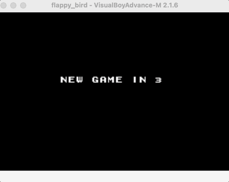
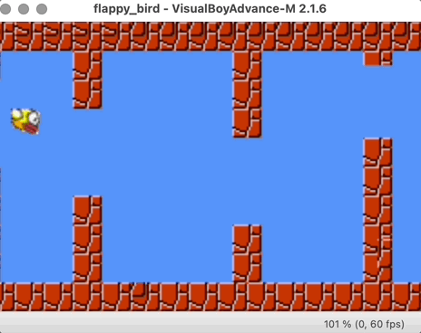

# GBA Flappy Bird

Flappy Bird recreation developed in C and ARM assembly for the Game Boy Advance.

**Author**: Joshua Williams

## Demo

### Game Start & Obstacle Navigation


### Collision & Game Over Screen


---

## Features

- **Scrolling tile background**: Hardware-supported 2D scrolling via background layers  
- **Animated sprite character**: Responsive movement system based on player-controlled jumps and gravity
- **Obstacle-based collision logic**: Detects collision with top and bottom pipes  
- **Retry system**: Lives-based structure allowing multiple attempts  
- **Speed progression**: Game difficulty increases with player performance  
- **Countdown and game over UI**: Styled messages and total score display  

---

## Technical Highlights

- **Execution**: Runs directly on GBA hardware with no OS  
- **Graphics**: Tile-based rendering with palette indexing and DMA transfers  
- **Sprites**: Uses GBA sprite memory for hardware-accelerated rendering  
- **Input**: Reads input from GBA button memory in real-time  
- **Scrolling**: X-scroll and Y-scroll logic tied to game progression  

---

### Requirements

- **GBA Cross-Compiler**: [`gbacc`](https://ianfinlayson.net/gba/00-setup) or [`devkitARM`](https://devkitpro.org/wiki/Getting_Started)  
- **GBA Emulator**: [mGBA](https://mgba.io/) or [VisualBoyAdvance](https://sourceforge.net/projects/vba/)  
- **Development Environment**: Native Linux setup or a preconfigured Linux-based GBA development VM  

---

### Build

Clone the repository from [https://github.com/jwilli39/GBA_Flappy_Bird](https://github.com/jwilli39/GBA_Flappy_Bird), then run:


```
make
```

This will produce the output file:

```
flappy_bird.gba
```

### Run

Launch the game using an emulator:

```
mgba flappy_bird.gba               # mGBA
visualboyadvance flappy_bird.gba   # VisualBoyAdvance
```

---

### Game Controls

| Action             | GBA Input     |
|--------------------|---------------|
| Flap / Ascend      | A Button      |
| Descend (gravity)  | Automatic     |
| Navigate obstacles | A Button (timing) |
| Restart (on death) | Automatic retry until out of lives |
| End Game           | After 5 failed attempts |

---

## Project Structure

| File                | Description                                     |
|---------------------|-------------------------------------------------|
| `main.c`            | Entry point that starts the game                |
| `flappyBird.c`      | Game loop controller and gameplay logic         |
| `flappy_utils.c`    | Utility functions for text display and delay    |
| `koopa_logic.c`     | Koopa character behavior and physics            |
| `koopa.c`           | Sprite and animation data for Koopa             |
| `sprite_utils.c`    | General sprite initialization and updates       |
| `sprite_position.c` | Functions for sprite movement and flipping      |
| `sprite_image.c`    | Image and palette loading for sprites           |
| `background_utils.c`| Background setup and screen clearing            |
| `map.c`             | Map data used for background scrolling          |
| `functions.s`       | Assembly functions (`increment_speed`, `countDown`) |
| `gba.c`             | GBA-specific functions (DMA, input, memory)     |
| `Makefile`          | Compilation script for building the project     |

---


## Flash to Hardware

To run the game on a real GBA:

1. Copy `flappy_bird.gba` to a microSD card  
2. Insert into an **EverDrive GBA** flash cartridge  
3. Insert cartridge into a real Game Boy Advance  
4. Launch the ROM using the EverDrive menu  

---

## Credits

GBA hardware specs and dev tools credited to [UMW CS GBA materials](https://ianfinlayson.net/gba/)

---

